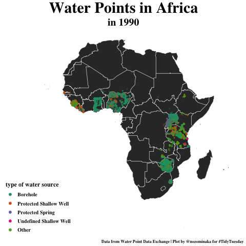

# TidyTuesday code and plots

**A weekly data project in R from the R4DS online learning community**
https://github.com/rfordatascience/tidytuesday/

**My weekly analyses and visualization of the datasets are posted below. Click on the image for the R code.**

### [2021](2021/)

| Week | Date | Data | Source | Plot & link to code |
| :---: | :----: | :--- | :--- | :---: |
| 22 | `2021-05-25` | [Mario Kart World Records](https://github.com/rfordatascience/tidytuesday/blob/master/data/2021/2021-05-25/readme.md) | [Mario Kart World Records](https://mkwrs.com/) | |
| 21 | `2021-05-18` | [Ask A Manager](https://github.com/rfordatascience/tidytuesday/blob/master/data/2021/2021-05-18/readme.md) | [Ask A Manager](https://www.askamanager.org/2021/05/some-findings-from-24000-peoples-salaries.html) | |
| 20 | `2021-05-11` | [Internet Access](https://github.com/rfordatascience/tidytuesday/blob/master/data/2021/2021-05-11/readme.md) | [Microsoft](https://github.com/microsoft/USBroadbandUsagePercentages) | |
| 19 | `2021-05-04` | [Water Access Points](https://github.com/rfordatascience/tidytuesday/blob/master/data/2021/2021-05-04/readme.md) | [wpdx](https://www.waterpointdata.org/) | |
